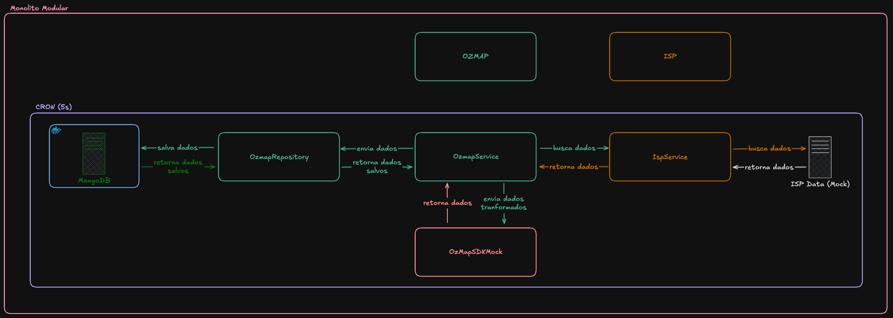

<h1 align="center" style="font-weight: bold;">ISP Data Importer 📊</h1>

 <a href="#technologies">Technologies</a> • 
 <a href="#description">Description</a> • 
 <a href="#installation">Installation</a> •
 <a href="#caveats">Caveats</a>

<h2 id="technologies">💻 Technologies</h2>

    

<h2 id="description">📚 Description</h2>

This application integrates data from a fictitious network management system with OZmap, a fiber network management tool.

It periodically retrieves data from the ISP system, converts it into the OZmap format, pushes it to OZmap via a mocked SDK, and persists the synchronized records into MongoDB.

Main features:
- Periodic synchronization with ISP (mocked with `json-server`);
- Data transformation into OZmap’s model;
- Persistence of records in MongoDB;
- Detailed and structured logging of the whole process.

<h2 id="installation">⚙️ Installation</h2>

1. Clone this repository: `git clone https://github.com/victorozoterio/isp-data-importer.git`;
2. Create an `.env` file from the `.env.example` file;
3. Fill in all the necessary variables in the `.env` file;
4. Install the dependencies by running the command: `pnpm install`;
5. Launch the Docker container by running the command: `docker compose up -d`;
6. Run the ISP system mock by running the command: `npx json-server --watch db.json --port XXXX`;
7. Run the application by running the command: `pnpm run start:dev`

<h2 id="caveats">⚠️ Caveats</h2>

The OZmap mock was implemented from the ISP mock provided to me. 
However, this ISP mock does **not contain all the data required by the `@ozmap/ozmap-sdk library`** to create resources.

For example, to create a **box**, the following fields are required: 
- `project`  
- `coords`  
- `hierarchyLevel`  
- `boxType`  
- `implanted`  

Some of this data is simply not present in the ISP mock provided.

Furthermore, the `@ozmap/ozmap-sdk` library does not have methods for **dropCables** or **customers** (or equivalents).
For this reason, only **boxes** and **cables** are actually being created and persisted to the database.
